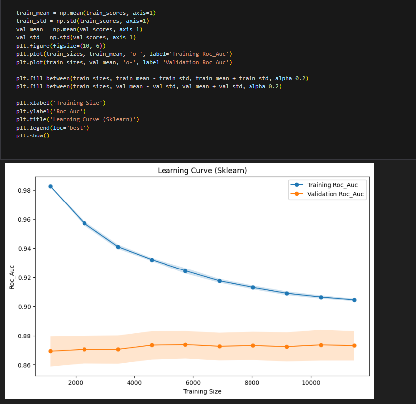
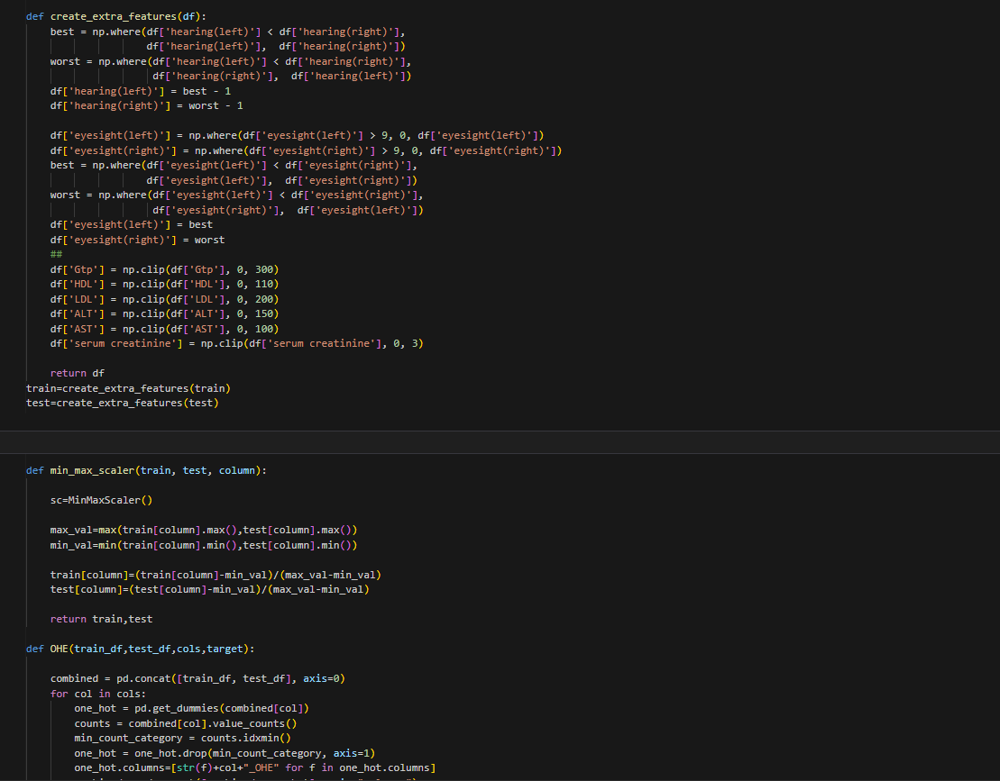
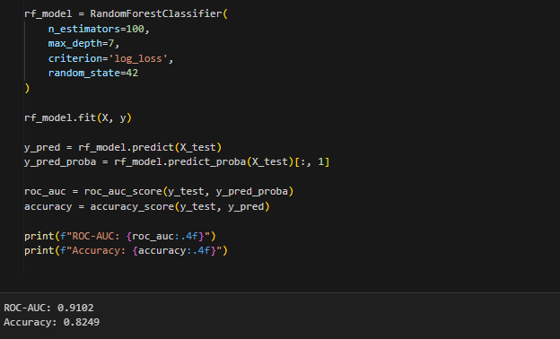
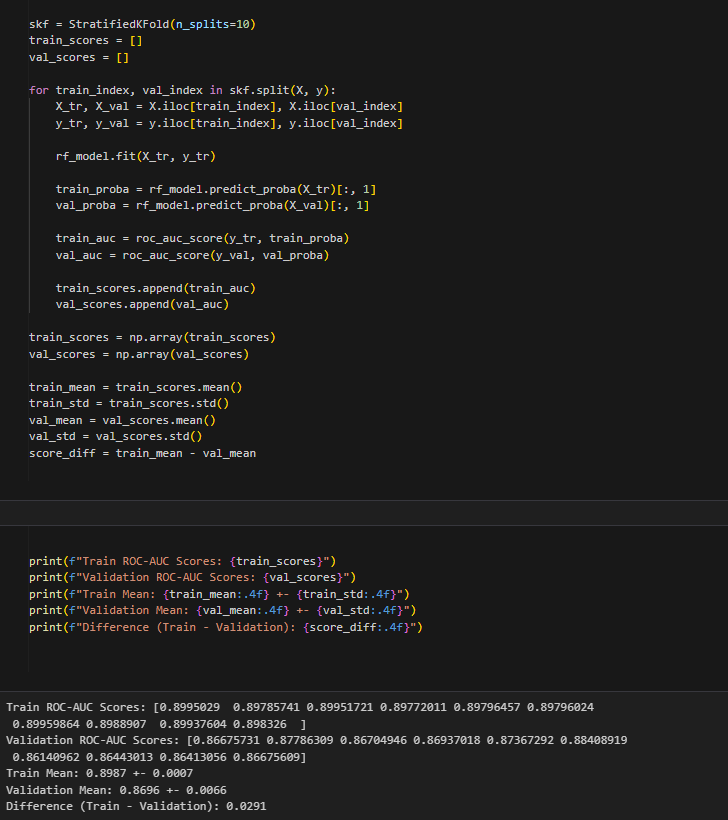

# About Data
The dataset for this competition (both train and test) was generated from a deep learning model trained on the Smoker Status Prediction using Bio-Signals dataset. Feature distributions are close to, but not exactly the same, as the original. Feel free to use the original dataset as part of this competition, both to explore differences as well as to see whether incorporating the original in training improves model performance.

# Machine Learning Examination - Notebook

## Overview
This Jupyter Notebook (`exam_ML_5.ipynb`) is designed for a machine learning examination or practice session. It covers various aspects of data analysis, preprocessing, model building, and evaluation. The notebook uses Python with popular libraries like `pandas`, `numpy`, `scikit-learn`, and others for implementing machine learning workflows. I also used the learning curve to see the state of the model.

### Contents
- **Data Preprocessing**: Includes handling missing values, feature scaling, and encoding categorical variables.
- **Feature Engineering**: Creation of new features and feature selection techniques.

- **Model Training**: Implementation of machine learning models such as RandomForestClassifier.

- **Model Evaluation**: Evaluation metrics like ROC-AUC and techniques for preventing overfitting.

### Prerequisites
- Python 3.x
- Jupyter Notebook
- Libraries: `pandas`, `numpy`, `scikit-learn`

